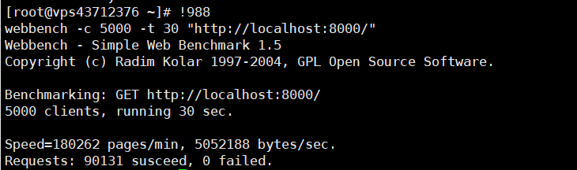
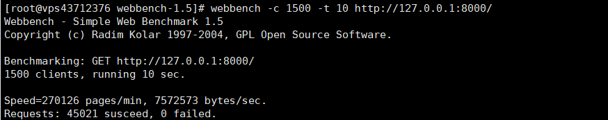

# MyHTTP
Linux下C++轻量级Web服务器
- 使用**线程池+NIO+EPOLL ET+事件处理模式(Reactor)**

## 测试环境
1核1G

CentOS Linux release 7.9.2009 (Core) 5.10.10-1.el7.elrepo.x86_64

CPU:Intel(R) Xeon(R) CPU E5-2680 0 @ 2.70GHz

## 目录树
```
.
├── bin
│   └── Myserver
├── build.sh
├── http
│   ├── Buffer.cpp
│   ├── Buffer.h
│   ├── HtppHelper.h
│   ├── HttpConn.cpp
│   ├── HttpConn.h
│   ├── HttpHelper.h
│   ├── HttpRequest.cpp
│   ├── HttpRequest.h
│   ├── HttpResponse.cpp
│   └── HttpResponse.h
├── log
│   ├── LOG.cpp
│   └── LOG.h
├── main.cpp
├── Makefile
└── webserver
    ├── SQLPool.cpp
    ├── SQLPool.h
    ├── ThreadPool.cpp
    ├── ThreadPool.h
    ├── webserver.cpp
    └── WebServer.h
```

## 项目运行
- build
```
sh ./MyHTTP/build.sh
```

- 启动项目
```
./MyHTTP/bin/Myserver &
```

**默认在8000端口启动服务器**

## 压力测试
update:2021/11/17



此测试在运行此项目的机器上运行，在1核1G的环境下实现5000并发数。

QPS: 3004

以下数据已过时



此测试在运行此项目的机器上运行，在1核1G的环境下实现1500并发数。
QPS: 4502

## 致谢
《Linux高性能服务器编程》 游双著.

《APUE》 

《UNP》
  
《鸟哥的Linux私房菜-基础篇》第四版

《c++标准库》《STL源码剖析》 侯捷

[@qinguoyi](https://github.com/qinguoyi/TinyWebServer),[@markparticle](https://github.com/markparticle/WebServer)
